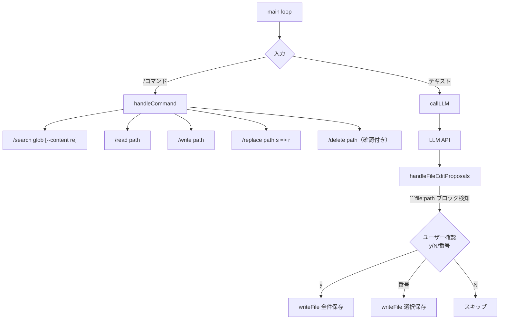
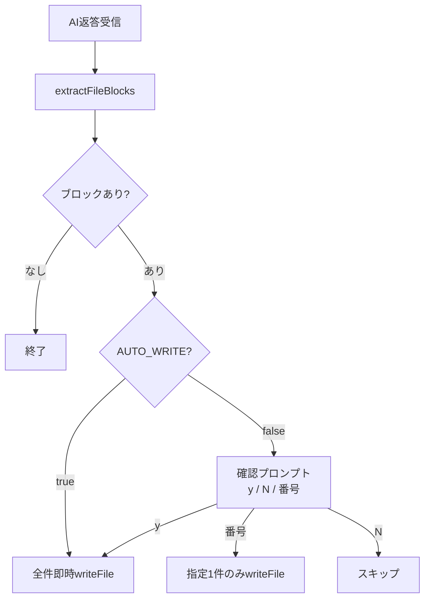

| 機能 | 実装内容 |
|---|---|
| ファイル検索 | glob/正規表現でファイル・内容を検索 |
| ファイル変更 | 行指定・正規表現での部分編集・全体上書き |
| ファイル削除 | 確認プロンプト付き安全削除 |
| チャット→ファイル反映 | ` ```file:path ` ブロックを自動検知・保存 |

------

## アーキテクチャ



---

## コマンド一覧

| コマンド | 説明 | 例 |
|---|---|---|
| `/search <glob>` | globでファイル検索 | `/search src/**/*.ts` |
| `/search <glob> --content <re>` | ファイル内容を正規表現検索 | `/search **/*.ts --content TODO` |
| `/read <path>` | 行番号付きで表示 | `/read src/index.ts` |
| `/write <path>` | 対話入力でファイル書き込み（`EOF`で終了） | `/write src/new.ts` |
| `/replace <path> <s> => <r>` | 文字列置換 | `/replace index.ts foo => bar` |
| `/delete <path>` | 確認付き削除 | `/delete old.ts` |
| `/history` | 履歴クリア | `/history` |

| 項目 | 変更内容 |
|---|---|
| `AUTO_WRITE` フラグ | `let` で宣言、`.env` の `AUTO_WRITE=true` で起動時ON |
| `extractFileBlocks()` | ブロック抽出を独立関数に分離（Model層） |
| `handleFileEditProposals()` | `AUTO_WRITE=true` 時は確認なしで全件即時保存 |
| `/autowrite [on\|off]` | 実行中にトグル可能なコマンド追加 |
| `resolveSafe()` | パス検証を共通化（セキュリティ強化） |

## 動作フロー



## 設定方法

```bash
# .env で常時ON
AUTO_WRITE=true