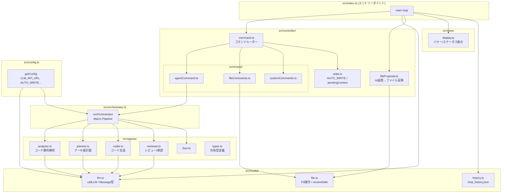
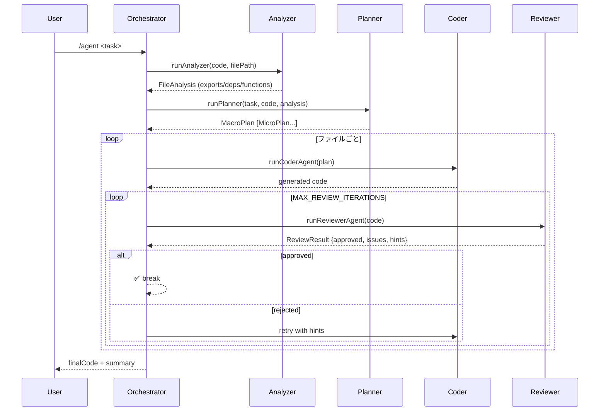

## 📋 まとめ

**open-llama-cli** は、ローカル/カスタムLLM APIと連携する **TypeScript製 CLIチャットツール** + **Multi-Agentオーケストレーター**。MVC構造を採用済み。

---

## アーキテクチャ全体図



---

## ファイル構成サマリー

| パス | 役割 | レイヤー |
|---|---|---|
| `src/index.ts` | エントリー・メインループ | - |
| `src/config.ts` | 環境変数読込・Config型 | Config |
| `src/model/llm.ts` | LLM API呼び出し（SSEストリーミング） | Model |
| `src/model/history.ts` | チャット履歴のJSON永続化 | Model |
| `src/model/file.ts` | FS操作・パス検証（resolveSafe） | Model |
| `src/view/display.ts` | CLI表示（chalk） | View |
| `src/controller/state.ts` | アプリ状態（AUTO_WRITE等） | Controller |
| `src/controller/command.ts` | コマンドルーター | Controller |
| `src/controller/command/agentCommand.ts` | `/agent` コマンド処理 | Controller |
| `src/controller/command/fileCommands.ts` | `/search /read /write /replace /delete` | Controller |
| `src/controller/command/systemCommands.ts` | `/help /clear /exit /autowrite` | Controller |
| `src/controller/fileProposal.ts` | AI返答の ` ```file:` ブロック検知・保存 | Controller |
| `src/orchestrator.ts` | Multi-Agentパイプライン制御 | Orchestrator |
| `src/agents/analyzer.ts` | コード静的解析Agent | Agent |
| `src/agents/planner.ts` | アーキテクチャ設計Agent | Agent |
| `src/agents/coder.ts` | コード生成Agent | Agent |
| `src/agents/reviewer.ts` | コードレビューAgent（承認/差し戻し） | Agent |
| `src/agents/fixer.ts` | 修正Agent | Agent |
| `src/agents/types.ts` | 共有型定義（TaskType, AgentContext等） | Shared |

---

## Multi-Agentパイプライン



---

## 主要技術スタック

| 項目 | 詳細 |
|---|---|
| 言語 | TypeScript 5.x / ESM |
| ランタイム | Node.js |
| LLM通信 | SSEストリーミング（fetch API）|
| LLM エンドポイント | `phis.jp`（カスタム）/ `gemma.phis.jp` |
| CLI描画 | chalk 5.x |
| ファイル検索 | glob 10.x |
| 履歴永続化 | `chat_history.json`（CWD） |
| ビルド | `tsc` → `dist/` |
| MVC準拠度 | ✅ 高（model/view/controller 分離済み） |

---

## 改善・注意点

| 区分 | 内容 |
|---|---|
| ⚠️ セキュリティ | `resolveSafe()` でパストラバーサル対策済み。ただし `chat_history.json` がCWD直置きでリポジトリにコミットされている |
| ⚠️ 状態管理 | `state.ts` のグローバル変数がプロセス内共有。マルチセッション非対応 |
| ⚠️ エラーハンドリング | Reviewer JSONパース失敗時のフォールバックが雑（`approved: false` 固定） |
| 💡 拡張余地 | LLMエンドポイントがハードコード気味。`.env` で完全外部化推奨 |
| 💡 テスト | ユニットテスト皆無。agents/ は純粋関数が多くテスト追加しやすい |